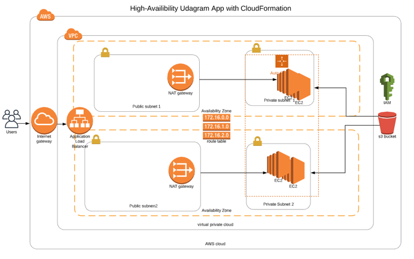
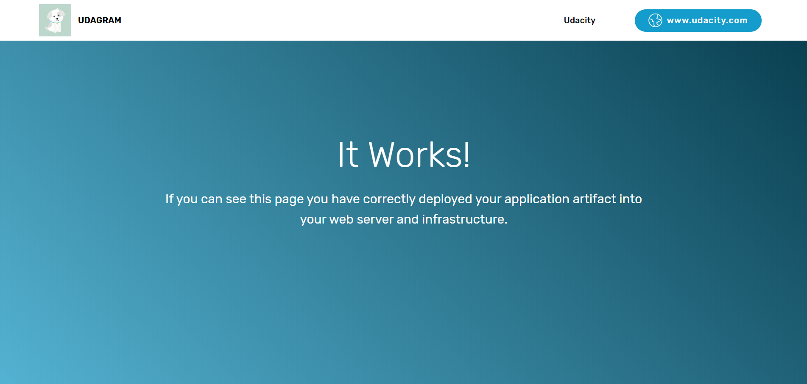

# CloudDevOps

Udacity Project 2 Deployment of High-Availability web services using CloudFormation.


**Problem**

The company is creating an Instagram clone called Udagram. The Udagram web app code is in a zip file located in a public S3 Bucket.

You have been tasked with deploying the application, along with the necessary supporting software into its matching infrastructure.
This needs to be done in an automated fashion so that the infrastructure can be discarded as soon as the testing team finishes their tests and gathers their results.

**Solution**

In this project, I deployed web servers for a highly available web app – Udagram using CloudFormation. I wrote the script that creates and deploys the infrastructure and application for an Udagram app. The script begin deploying the infrastructure components followed by servers, security roles and compute resources.

[Website Link](http://udagr-webap-151lepxel4r3y-650308300.us-west-2.elb.amazonaws.com/)

**Architecture diagram**




```
- Udagram code
- Architecture diagram
- How to build
- Images
- Udagram web app
```

**How to build**

```
./create.sh udagraminfra udagraminfra.yml udagraminfraparameters.json
./create.sh udagramrole role.yml roleparameters.json
./create.sh udagramservers servers.yml serversparameters.json
```

create.sh

```
aws cloudformation create-stack \
--stack-name $1 \
--template-body file://$2 \
--parameters file://$3 \
--region=us-west-2 \
--capabilities CAPABILITY_IAM
```

delete.sh

```
aws cloudformation delete-stack \
--stack-name $1
```



Screenshots the results of deployment with CloudFormation in the Images folder.